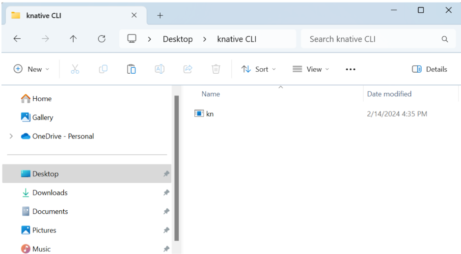

<h1 align="center"> INSTALACIONES</h1>

## ÍNDICE
+ [Volver al Inicio](readme)
- [OpenShift CLI](#Para?)
- [kNATIVE CLI](#QUE_ES?)
- [Instalación OpenShift Serverless Operator](#Beneficios)

 
 

<h1 align="center"> Instalación OpenShift CLI (OC)</h1>

## PASO A PASO
1- Vaya a la página de descargas de OpenShift Container Platform en el Portal del cliente de Red Hat. LINK ????

2- Seleccione la versión adecuada segun las caracteristicas de su equipo en el menú desplegable Versión.

3- Descargue el archivo ZIP de la CLI de OpenShif (oc)

4- Mueva el binario a un directorio en su archivo.

5- Agregue el binario al PATH

## Verificación de la instalación
- Ingrese a la terminal Windows PowerShell e ingrese a la ubicación del archivo

- Ejecute el comando oc

 
 
<h1 align="center"> INSTALACIÓN KNATIVE CLI </h1>

## PASO A PASO

 1- Descargue el archivo ZIP de la CLI de Knative (kn) que se encuentra disponible en la web [Install Knative](https://docs.openshift.com/serverless/1.30/install/installing-kn.html#installing-cli-windows_installing-kn) 

2- Extraiga el archivo con un programa ZIP.

3- Cambie el nombre del archivo a __kn__ 

4- Mueva el binario a un directorio en su archivo.

5- Agregue el binario al PATH

 

## Verificación de la instalación

1- Ingrese a la terminal Windows PowerShell e ingrese a la ubicación del archivo

2- Ejecute el comando .\kn

3- Ejecute el comando kn version

 
 

<h1 align="center"> Instalación OpenShift Serverless Operator </h1>

## PASO A PASO

- Inicie sesiòn en https://console.redhat.com/openshift/

- Debe crear un Cluster. Tenga en cuenta que el requisito mínimo para utilizar OpenShift Serverless es un clúster con 10 CPU y 40 GB de memoria. De forma predeterminada, cada pod solicita ~400 m de CPU, por lo que los requisitos mínimos se basan en este valor.

inicio de sescion

